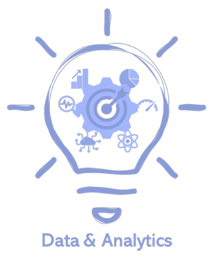
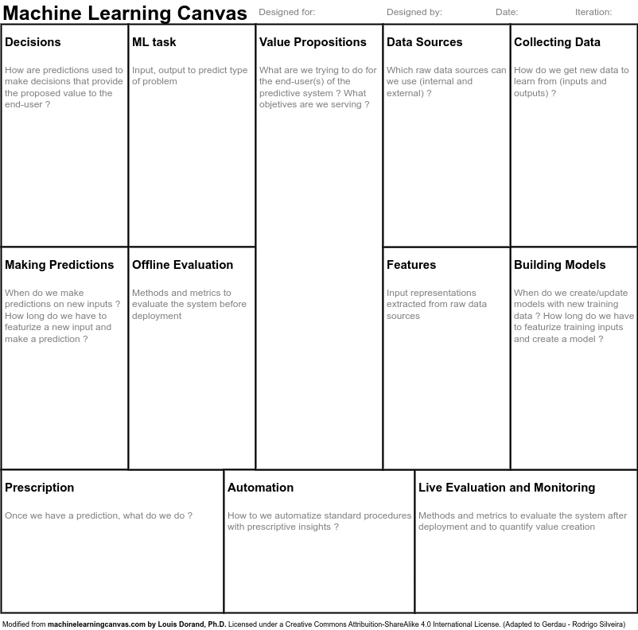

# Data4All - Business Case

- Instituição: Let's Code
- Curso: Data4All
- Projeto: Business Case
- Empresa(s): Gerdau & Randstad

 

#### **Introdução**

O time de Data Science da Gerdau usa Inteligência Artificial e Advanced Analytics para resolver problemas diversos dentro da nossa empresa. Nesse desafio você terá contato com algumas das tarefas diárias de um Cientista de Dados do time e como ele avaliaremos, como suas competências estão conectadas com nossos pilares técnicos e do negócio.

Guiaremos você ao longo do problema, e sua senioridade, de acordo com nossos padrões e pilares, será definida pela maneira como você resolverá cada item.

#### **O que você deve levar em consideração**

* Descrever a abordagem utilizada na resolução do desafio
* Trechos de códigos deverão ter comentários essenciais
* O desafio deverá ser feito com a linguagem de programação Python + bibliotecas que você achar necessário
* Soluções utilizando Excel, R e outras linguagens serão desconsideradas
* Recomendamos utilizar Jupyter Lab ou Notebook. 

#### **Prazo de entrega**

* De acordo conforme combinado com o time de Data & Analytics

#### **Desclassificação Automática**

* Entregar fora do prazo
* Compartilhar sua solução com outras pessoas
* Compartilhar sua solução em repositórios públicos. Exemplo: GitHub

#### **Objetivo**

A produção de uma empresa de aço envolve a fabricação de vários tipos de componentes, incluindo bobinas e placas. As informações sobre o consumo de energia são registradas em um sistema de armazenamento em nuvem. O monitoramento do consumo energético desta indústria está disponível nos dados fornecidos. Desta forma, **gostariamos que você preveja o consumo elétrico em uma perspectiva mensal**.

## Conteúdo
- Machine Learning Canvas
- Tecnologias
- Base de dados
- Instalação
- Organização do projeto
- Commits
- Conclusão
- License

## Machine Learning Canvas
Para conceituar o problema iremos utilizar uma modificação do [Machine Learning Canvas](http://machinelearningcanvas.com/). Esta variação seguirá o modelo abaixo:

 

O machine learning canvas construído ao longo do projeto pode ser encontrado [aqui](https://github.com/MatBrands/Data4All_Business-Case/blob/master/utils/Machine%20Learning%20Canvas.pdf).

## Tecnologias

- Python
- Conda
- Jupyter
- Numpy
- Pandas
- Matplotlib
- Seaborn
- Scikit-learn
- Tensorflow
- Keras

## Base de dados
Neste projeto iremos analisar um dataset em formato de csv disponibilizado pelo time de Data & Analytics da Gerdau. Seus metadados estão dispostos da seguinte maneira:

Temos acesso aos dados de consumo elétrico da empresa, referentes a um período de 1 ano, sendo que a medição é realizada em intervalos de 15 minutos.
| Nome          | Description.                                         | Tipo Variável | 
|---------------|------------------------------------------------------|---------------|
| Data          | Data de registro do consumo                          | Continua      |
| Energia_usada | Consumo de energia da empresa [kWh]                  | Continua      |
| V1            | Corrente atrasada [kVarh]                            | Continua      |
| V2            | Corrente principal [kVarh]                           | Continua      |
| V3            | Medições de C02 [ppm]                                | Continua      |
| V4            | Fator de potência atual atrasado                     | Continua      |
| V5            | Fator de potência atual principal                    | Continua      |
| V6            | Número de segundos a partir da meia-noite [S]        | Continua      |
| V7            | Estado da semana (Final de semana ou dia da semana)  | Categorica    |
| V8            | Dia da semana (Terça-feira, Sábado, etc)             | Categorica    |
| V9            | Tipo de carga (Carga leve, Carga média, Carga máxima) | Categorica    | 

## Instalação
Foi utilizado o [Python](https://www.python.org/) v3.11.3.

### Conda
No desenvolvimento foi utilizado o gerenciador de pacotes e ambientes [Conda](https://docs.conda.io/en/latest/). Portanto para prosseguir necessita-se de sua instalação.

Navegar até a pasta de destino
```sh
cd utils
```

Instalar dependências
```sh
conda env create -f environment.yml
```

Ativar
```sh
conda activate data4all_case_venv
```

Desativar
```sh
conda deactivate
```

### Requirements
Pode-se utilizar o arquivo requirements.txt para criar o ambiente virtual.

Criar ambiente virtual
```sh
python -m venv data4all_case_venv
```

Ativar
```sh
source ./data4all_case_venv/bin/activate
```

Navegar até a pasta de destino
```sh
cd utils
```

Instalar dependências
```sh
pip install -r requirements.txt
```

Desativar
```sh
deactivate
```

## Organização do projeto
```sh
.
├── License
├── Readme.md
├── main
│   ├── datasets
│   │   ├── raw.csv
│   │   └── processed.pkl
│   ├── media
│   │   └── data_analytics.png
│   ├── notebooks
│   │   ├── Desafio_Ciencia_de_Dados_Gerdau.ipynb
│   │   ├── eda.ipynb
│   │   ├── model.ipynb
│   │   └── tratative.ipynb
│   └── outputs
│       ├── KFold_MAE_0.png
│       ├── KFold_MAE_1.png
│       ├── KFold_R2_0.png
│       ├── KFold_R2_1.png
│       ├── Learning_Curve_0.png
│       ├── Learning_Curve_1.png
│       ├── Scores_0.png
│       └── Scores_1.png
└── utils
    ├── Business Case.pdf
    ├── Machine Learning Canvas.pdf
    ├── machine_learning_canvas.png
    ├── Tratamento dos Dados.pdf
    ├── Análise Exploratória de Dados.pdf
    ├── Modelagem de ML.pdf
    ├── environment.yml
    └── requirements.txt
```

## Commits
Neste projeto foi adotado o uso de Commits Semânticos para padronização:

- Feat: Nova feature do projeto
- Refactor: Refatoração de alguma parte do código
- Fix: Correção de erros que estão causando bugs
- Chore: Mudanças que não influenciam o sistema nem arquivos de testes
- Style: Mudanças de formatação ou estilos de códigos que não influenciam na lógica do sistema
- Test: Criação ou alteração de algum código de teste
- Perf: Alterações feitas para melhorar a performance do projeto
- Docs: Alterações na documentação do projeto

## Conclusão
O projeto foi dividido em algumas etapas, sendo elas:
- [Machine Learning Canvas](./utils/Machine%20Learning%20Canvas.pdf)
- [Tratamento dos Dados](./utils/Tratamento%20dos%20Dados.pdf)
- [Análise Exploratória de Dados](./utils/Análise%20Exploratória%20de%20Dados.pdf)
- [Modelagem de ML](./utils/Modelagem%20de%20ML.pdf)

## License
MIT.